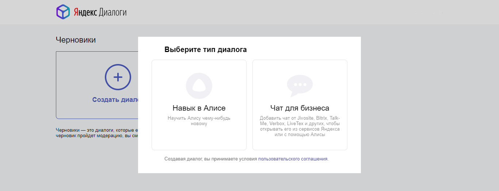
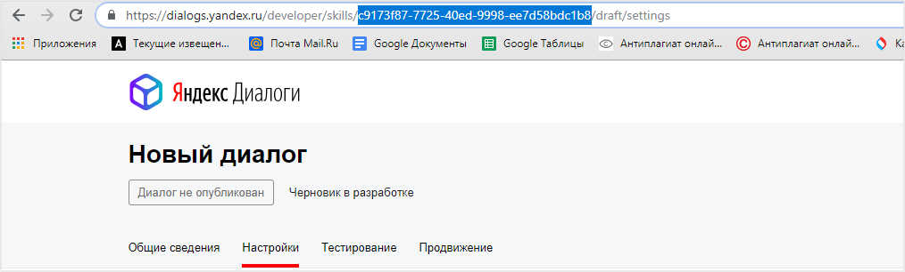
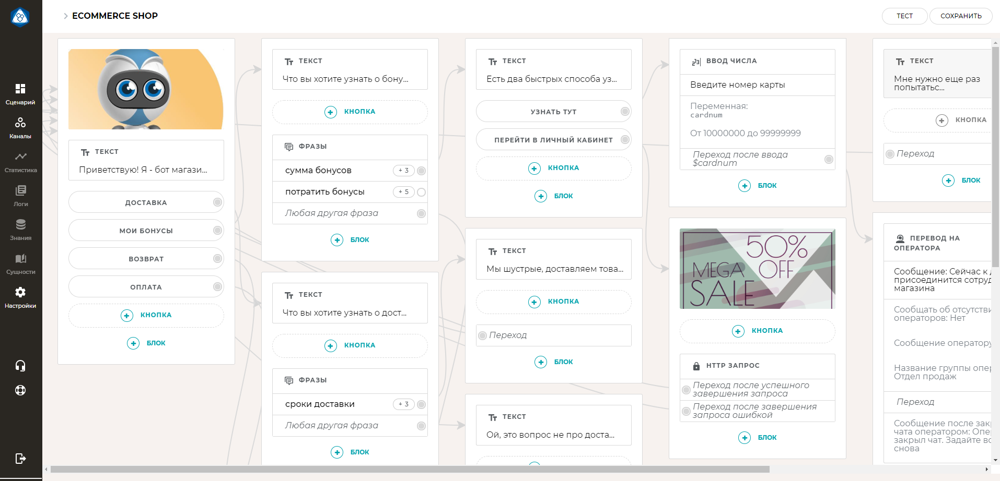

# sii-2-block-of-labs

## ЛР6. Тематика и сценарии бесед.

### Тема: Спортивные игры
#### Список вопросов/сценариев
    определенный вид игр = (Командные игры, Индивидуальны игры, Военно-спортивные игры, Интелектуаьлные игры)
    
    - Какие виды существуют?
    - Приведите примеры [определенный вид игр]
        [Общие вопросы командных игр]
            - В [командная игра] сколько человек в команде?
            - Какие бывают амплуа [в [командная игра]]? 
            - Сколько длится матч [в [командная игра]]?
            - Какая игровая площадка [в [командная игра]]?
        
        [Баскетбол]
            - Как подсчитываются очки в баскетболе?
            - Что такое НБА? 
     
        [Футбол]
            - За что дают желтую карточку в футболе?
            - За что дают красную карточку в футболе?
     
        [Хоккей]
            - Какая страна является родиной хоккея с шайбой?
            - С какой периодичностью проводится чемпионат мира по хоккею?
        
        [Волейбол]
            - До скольки очков длится партия в волейболе?
            - Сколько тайм-аутов может взять команда в одной партии в волейболе?
        
        [Регби]
            - Регби входит в олимпийский вид спорта?
            - Когда можно начинать участвовать в соревнованиях в регби?
        
        [Теннис]
            - Сколько продолжалась самая длительная игра в теннисе?
            - Почему теннисисты кричат во время ударов?
        
        [Настольный теннис]
            - До скольки очков продолжается партия в настольном теннисе?
            - В какой стране настольный теннис является национальным видом спорта?
        
        [Бадминтон]
            - Что такое бадминтон?
            - До скольких очков играют в бадминтон?
        
        [Пейнтбол]
            - Какое ограничение по возрасту в пейнтболе?
            - Из чего сделан шарик для пейнтбола?
        
        [Шахматы]
            - Кто такой гроссмейстер? 
            - Самый известный гроссмейстер России?
        
        [Шашки]
            - Сколько фигур в игре в шашках?
            - На каком цветовом поле ведется игра в шашках? 
      
## ЛР7. Диалоговая система.
Код в файле main.py

#### Реализация мини-диалоговой системы
Вопрос пользователя разбивается на слова, каждому слову ищется соответствующий тэг в словаре,
затем по получившемуся набору тэгов ищется ответ на заданный вопрос.

Если не находит совпадение по заданному множеству тэгов, то система отвечает, что она не понимает заданного вопроса.
У слов синонимов общий тэг, таким образом можно задавать вопросы по-разному

Так как используется множество тэгов, то порядок слов вопросе может быть различен.    
## ЛР9. Кастомизация мультимодального интерфейса

###
Спортивный Волк-консультант поможет в выборе подходяшего вам конкретного вида спорта, проконсультирует по различным вопросам и составит вам увлекательную компанию в необычной беседе, между волком и человеком! 
###   Реакции:
    
##### Приветствие:
 
 (1) "ЗдРРРавствуйте! Чем я могу Вам помочь?"

#####Отказ от диалога:

(2) "Вас понял! Если что,я всегда буду рад помочь!"

#####Помощь в выборе:

(3) "Вы определились каким видом споРРРта хотите заняться?"

(4) "Давайте попробуем опРРРеделить ваши предпочтения и я найду для Вас что-нибудь подходящее."

(5) "Вам нРРРавятся активные,командные или интеллектуальные игры?"

(6) "Хорошо, сейчас подбеРРРу для Вас варианты!"

(7) "Основываясь на ваших предпочтениях,я могу пРРРедложить Вам данные виды спорта."

(8) "Я очень рад, что помог Вам с выбоРРРом!"

#####Волк не распознал вопрос:

(9) "Не очень понимаю Ваш вопРРРос, можете задать его по-другому?"

#####Пользователь использовал нецензурную лексику:

(10) "Ладно,сделаю вид, что ничего не слышал!"

#####Пользователь угрожает:

(11) "Ну погоди,я ведь могу укусить Вас за бочок!"

#####Пользователь рассказал что-то интересное:

(12) "Вот это да!"

##### Пользователь спрашивает о погоде:

(13) "У природы нет плохой погоды!"

#####Пользователь спрашивает каким видом спорта занимается наш Волк:

(14) "О, я очень люблю тяжелую атлетику и РРРегби!"

#####Пользователь спрашивает ел ли Волк бабушку Красной шапочки:

(15) "Да, ты следущий! ХА-ХА"

#####Пользователь просит рассказать анекдот:

(16) "Сколько волка не корми, все равно больше медведя не наделает."

#####Пользователь не определился с выбором и ушел:

(17) "Ауф!Как жаль."

#####Пользователь удовлетворил все свои запросы и прощается:

(18) "Буду рад видеть Вас снова!"

#####Пользователь задает вопрос про семью Волка

(19) "Hаc пo-прежнeму двoe: я и мoя cвoбода."

#####Пользователь оскорбляет Волка:

(20) "Волка каждый может обидеть, но не каждый может убежать!"

## РК2 (Вар. 8) - Как написать скилл для Алисы и внедрить его

Алиса уже умеет рассказывать о погоде, выбирать подарки, строить маршруты и многое другое. Но вы можете расширить возможности Алисы еще сильнее: создать навык для заказа еды, перевода денег, консультации клиентов банков и страховых компаний и так далее.

Чтобы научить Алису чему-то новому, нужно создать навык на платформе Яндекс.Диалоги:

- С точки зрения пользователя, навык — это специализированный режим Алисы, который вызывается определенным вами активационным именем. В этом режиме Алиса транслирует реплики пользователя на ваш сервер, и отвечает переданным вами текстом, ссылками или подсказками.
- С технической точки зрения, навык — это веб-сервис, который ожидает реплик пользователя от Яндекс.Диалогов. Веб-сервис можно писать на любом удобном вам языке программирования или веб-фреймворке — он должен только корректно отвечать на запросы Диалогов.

Чтобы ваш навык был доступен в Алисе:
Разработайте и протестируйте веб-сервис, который сможет отвечать на запросы Яндекс.Диалогов. Для начала можно использовать примеры простых навыков для Node.js и Python.

Опубликуйте навык на Яндекс.Диалогах.

### Работа в Яндекс.Диалогах

Для того, чтобы создать навык, нужно зарегистрироваться на сайте конструктора и на платформе Яндекс.Диалоги. В Яндекс.Диалогах необходимо добавить диалог с помощью кнопки и выбрать его тип — навык для Алисы.

На странице диалога будет его идентификатор: его нужно скопировать в конструктор, чтобы затем импортировать из него алгоритм.

### Работа в конструкторе

С помощью визуальных конструкторов можно создавать деревья, которые соответствуют ходу диалога. А переход по ветвям зависит от того, как пользователь будет реагировать на действия навыка.

В навыки можно добавлять кнопки для того, чтобы пользователь мог задавать простые команды не голосом, а быстрым нажатием (например, в отдельную кнопку обычно выносят команду «помощь»). 

Ещё в конструкторах используется метод «HTTP-запрос». С его помощью конструктор может получать данные из внешних источников: например, облачных хранилищ или таблиц. Контент для навыка можно хранить и внутри конструктора, но это усложнит архитектуру диалога и его редактирование — поэтому так делать не стоит.

### Как опубликовать навык
Для того, чтобы навык можно было использовать любому пользователю, его нужно разместить в каталоге. Чтобы опубликовать диалог, его нужно зарегистрировать в консоли разработчика.

Сперва понадобится задать настройки навыка: название, URL, фразы, активирующие навык, и голос, который он может использовать.

Название навыка для каталога должно состоять не менее чем из двух слов, быть написанным на русском или английском языке и не ограничиваться общей категорией («пластиковые окна» или «путешествия» не подходят). Также имя должно быть уникальным и не содержать слов «Алиса», «Яндекс» или «Станция».

Активационное имя — это фраза, по которой навык можно вызвать в разговоре с Алисой. В этой фразе должна содержаться сокращённая или развёрнутая форма названия: так, для навыка «Верю — не верю» можно использовать имя «играть в верю — не верю».

Голос для озвучивания навыка можно выбрать из специального списка: в него включен как привычный голос Алисы, так и более необычные, например, Эркан Явас — голос, которым озвучиваются Яндекс.Новости.

Ещё перед проверкой нужно выбрать устройства, которые будут поддерживать работу навыка (чтобы модераторы проверили его на всех из них), и протестировать ответы навыка на его странице в личном кабинете.

После того, как вы отправите навык на проверку, результат модерации появится в личном кабинете в течение трех дней. Если навык одобрят, то его можно будет отправить на публикацию кнопкой «опубликовать». А в каталоге навыков Алисы он появится спустя 5–10 минут.